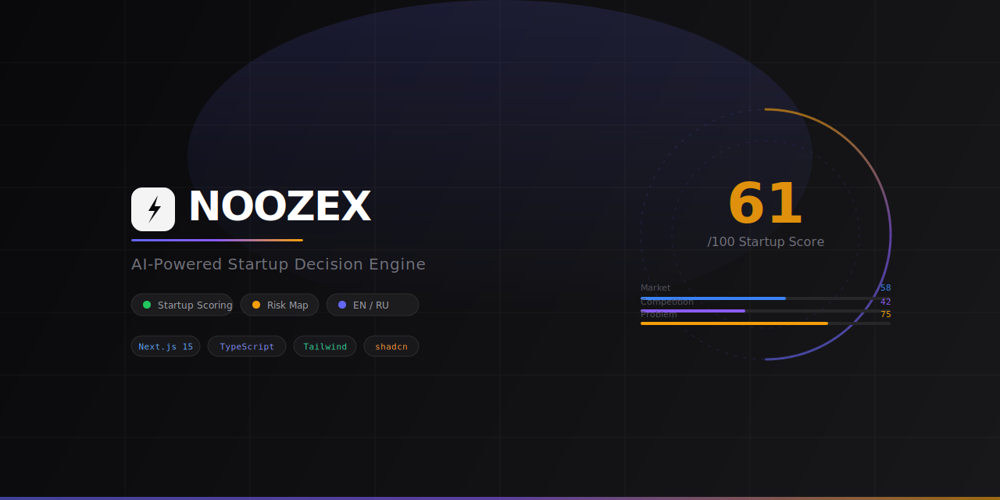
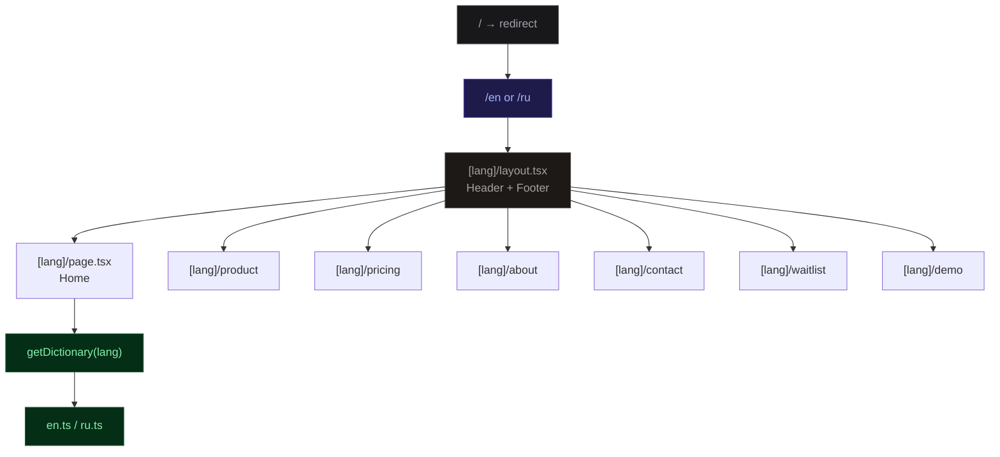

<div align="center">
  
</div>

<br/>

<div align="center">

[](https://nextjs.org)
[](https://typescriptlang.org)
[](https://tailwindcss.com)
[](https://ui.shadcn.com)
[](https://framer.com/motion)

[](LICENSE)
[]()
[]()

</div>

<br/>

> **NOOZEX** — AI decision engine for startup founders. Score ideas, map risks, validate demand, and know exactly what to do next — before writing a single line of product code.

<br/>

## ✦ Overview

Most founders don't fail because they can't build. They fail because they build the wrong thing.

NOOZEX is a bilingual SaaS landing site built with Next.js 15 App Router, showcasing a startup validation platform that helps founders make evidence-based decisions instead of guessing.

<br/>

## ⚡ Features

| Feature | Description |
|---|---|
| 🌐 **Bilingual i18n** | Full EN / RU support via `/[lang]` routing — zero client-side redirect, statically generated |
| 🎨 **Animated UI** | Framer Motion entrance animations, animated score ring, live progress bars |
| 📊 **Score Mockup** | Interactive startup score card with animated SVG ring and dimension bars |
| 📋 **Multi-page** | Home, Product, Pricing, About, Contact, Waitlist, Demo — 7 pages × 2 languages |
| 📬 **Forms** | React Hook Form + Zod validation on Contact and Waitlist pages |
| 🌙 **Dark-ready** | Tailwind CSS v4 with full dark mode via CSS variables |
| ⚡ **Static export** | All pages prerendered as static HTML via `generateStaticParams` |
| 📱 **Responsive** | Mobile-first, fully responsive from 320px to 1440px+ |

<br/>

## 🛠 Tech Stack

<div align="center">

| Layer | Technology |
|---|---|
| **Framework** | Next.js 15 (App Router, Turbopack) |
| **Language** | TypeScript 5 |
| **Styling** | Tailwind CSS v4 |
| **Components** | shadcn/ui (base-ui primitives) |
| **Animation** | Framer Motion 11 |
| **Forms** | React Hook Form + Zod |
| **Icons** | Lucide React |
| **Font** | Geist Sans + Geist Mono |

</div>

<br/>

## 📁 Project Structure

```
noozex-site/
├── src/
│   ├── app/
│   │   ├── [lang]/                  # i18n routing
│   │   │   ├── layout.tsx           # Shared layout with Header + Footer
│   │   │   ├── page.tsx             # Home page
│   │   │   ├── product/page.tsx     # Product features page
│   │   │   ├── pricing/page.tsx     # Pricing plans page
│   │   │   ├── about/page.tsx       # About / manifesto page
│   │   │   ├── contact/page.tsx     # Contact form
│   │   │   ├── waitlist/page.tsx    # Waitlist signup form
│   │   │   └── demo/page.tsx        # Interactive dashboard mockup
│   │   ├── layout.tsx               # Root layout
│   │   └── page.tsx                 # Redirect → /en
│   ├── components/
│   │   ├── layout/
│   │   │   ├── Header.tsx           # Sticky header + mobile sheet nav
│   │   │   └── Footer.tsx           # Footer with links
│   │   ├── sections/
│   │   │   ├── HeroSection.tsx      # Hero + animated score card
│   │   │   ├── ProblemSection.tsx   # Problem cards
│   │   │   ├── SolutionSection.tsx  # Feature grid
│   │   │   ├── HowItWorksSection.tsx# Step-by-step process
│   │   │   ├── ScoringSection.tsx   # Scoring engine explainer
│   │   │   ├── PricingSection.tsx   # Pricing plans grid
│   │   │   ├── FAQSection.tsx       # Accordion FAQ
│   │   │   └── FinalCTASection.tsx  # Bottom CTA band
│   │   ├── mockups/
│   │   │   └── ScoreCard.tsx        # Animated startup score card
│   │   └── ui/                      # shadcn/ui components
│   └── lib/
│       ├── i18n/
│       │   ├── en.ts                # English dictionary (~300 strings)
│       │   ├── ru.ts                # Russian dictionary (~300 strings)
│       │   └── index.ts             # getDictionary() helper
│       └── utils.ts                 # cn() utility
```

<br/>

## 🏗 Architecture



<br/>

## 📊 Page Scoring Mockup

The hero section features an animated startup score card that demonstrates the core product concept:

```
┌─────────────────────────────┐
│  ⚡ NOOZEX Analysis          │
│  ┌─────────────────────┐    │
│  │         61          │    │  ← animated SVG ring
│  │        /100         │    │
│  └─────────────────────┘    │
│  Validate before building   │
│                             │
│  ⚠  Crowded market          │
│  📈 Test with 10 users      │
│                             │
│  Market      ████░░  58     │
│  Competition ███░░░  42     │
│  Problem     █████░  75     │
│  Monetize    ████░░  64     │
│  Execution   █████░  70     │
└─────────────────────────────┘
```

<br/>

## 🚀 Getting Started

### Prerequisites

- Node.js 20+
- npm / yarn / pnpm

### Installation

```bash
# Clone the repository
git clone https://github.com/xelA31B/noozex-site.git
cd noozex-site

# Install dependencies
npm install

# Start dev server
npm run dev
```

Open [http://localhost:3000](http://localhost:3000) — it will redirect to `/en`.

### Available routes

| Route | Page |
|---|---|
| `/en` | Home (English) |
| `/ru` | Home (Russian) |
| `/en/product` | Product features |
| `/en/pricing` | Pricing plans |
| `/en/about` | About & manifesto |
| `/en/contact` | Contact form |
| `/en/waitlist` | Join waitlist |
| `/en/demo` | Dashboard mockup |

### Build

```bash
npm run build   # Production build (static export)
npm run start   # Preview production build
```

<br/>

## 🌐 i18n Architecture

All copy lives in typed dictionaries — no external i18n library needed:

```typescript
// src/lib/i18n/index.ts
export function getDictionary(lang: Lang) {
  return dictionaries[lang] ?? dictionaries.en
}

// Usage in any server component
const dict = getDictionary(lang as Lang)
```

Each dictionary is `as const` — TypeScript catches missing keys at compile time.

<br/>

## 📦 Pricing Tiers (Product)

| Plan | Price | Target |
|---|---|---|
| **Free** | $0 | Try it with 1 idea |
| **Pro** | $29/mo | Active founders |
| **Builder** | $49/mo | Founders who execute |
| **Studio** | From $199/mo | Teams & accelerators |

<br/>

## 🗺 Roadmap

- [x] Bilingual landing site (EN / RU)
- [x] Animated score card mockup
- [x] 7 pages with full copy
- [x] Contact & Waitlist forms with validation
- [x] Interactive demo dashboard
- [ ] Connect waitlist form to backend / email
- [ ] Add OG image generation for each page
- [ ] Vercel deployment + custom domain
- [ ] Full product MVP (scoring engine API)
- [ ] Stripe billing integration

<br/>

## 📄 License

MIT © [xelA31B](https://github.com/xelA31B)

<br/>

<div align="center">
  <sub>Built with precision. Validated before shipped.</sub>
</div>
